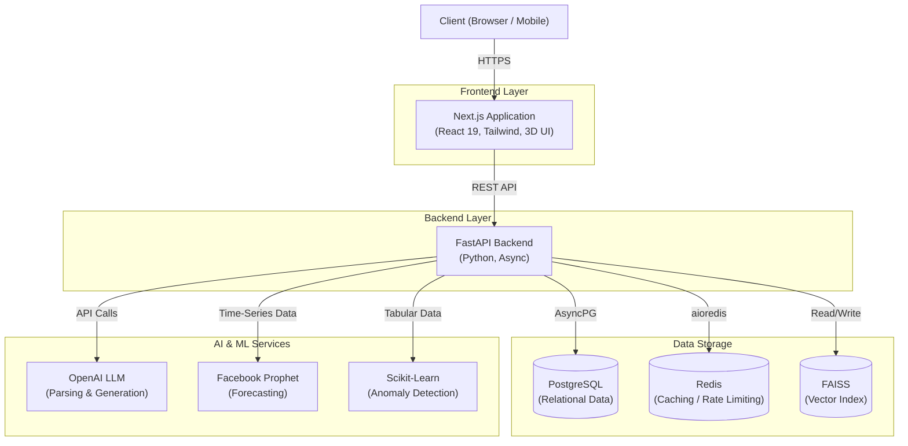
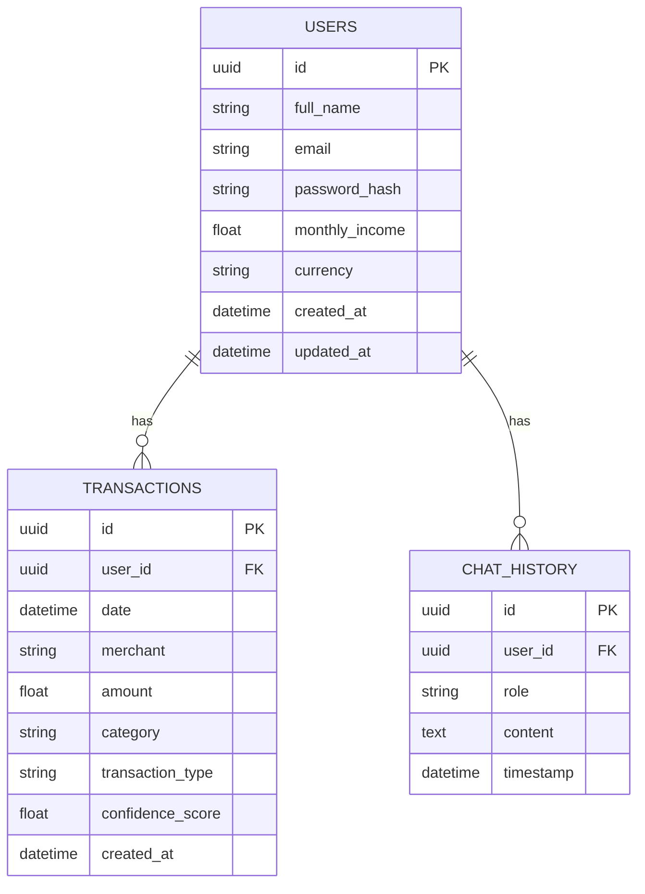
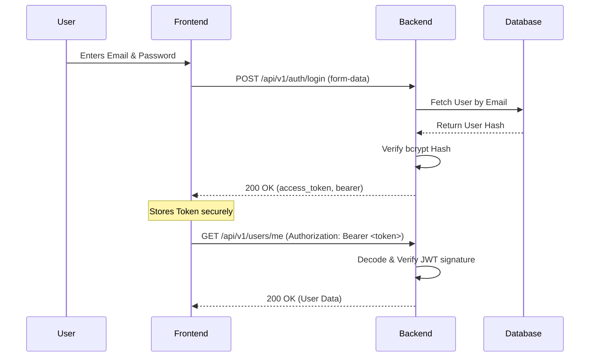
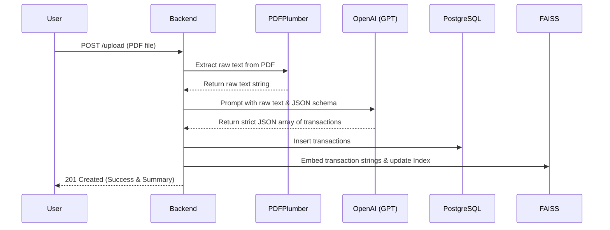
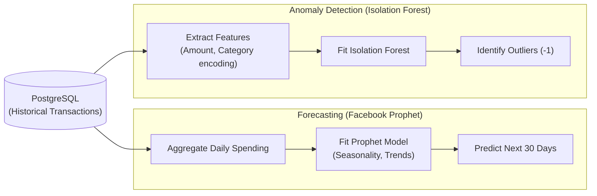
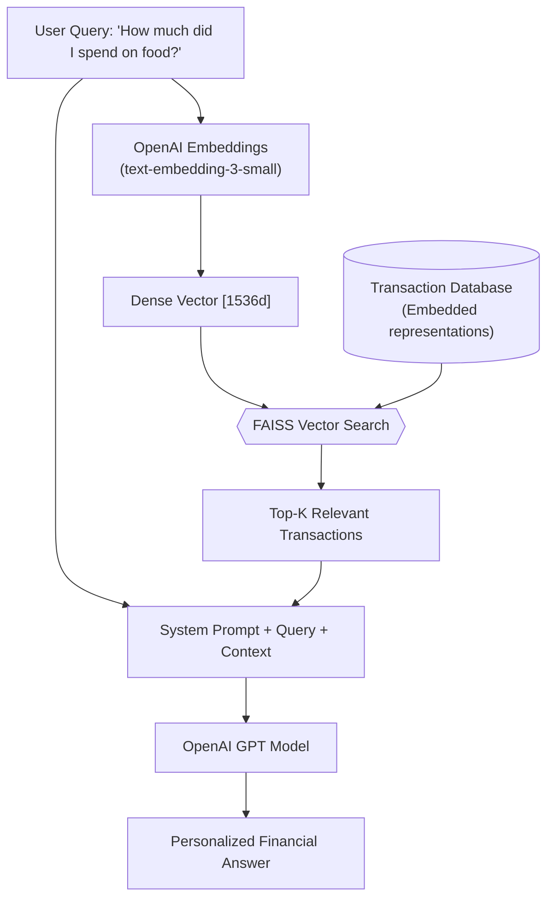
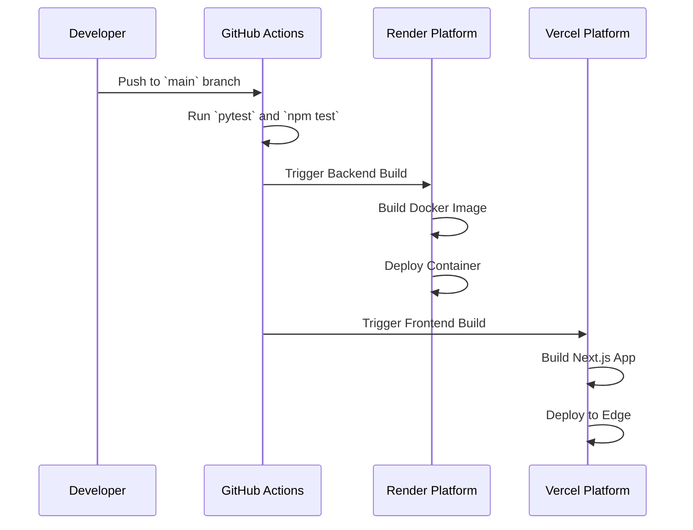
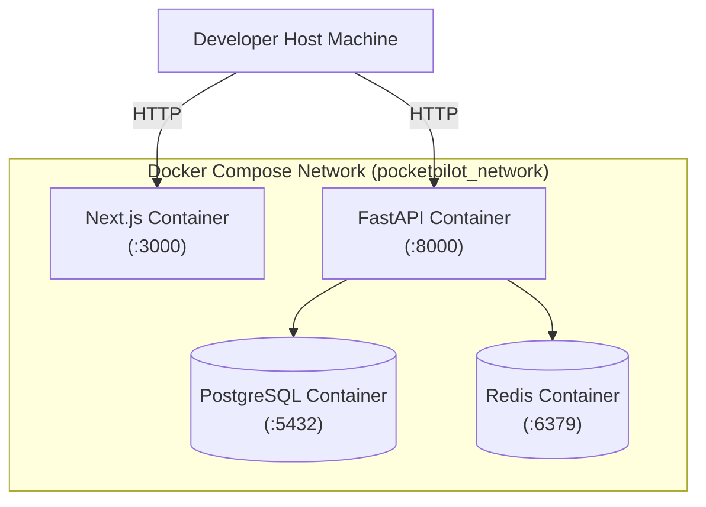

# PocketPilot Architecture Diagrams

This document provides visual representations of the various systems, pipelines, and infrastructure that power PocketPilot. All diagrams are generated using [Mermaid.js](https://mermaid-js.github.io/mermaid/).

---

## 1. Overall System Architecture

---

## 2. Database ER Diagram

---

## 3. Authentication Flow (OAuth2 with JWT)

---

## 4. Transaction Processing Flow (AI Parsing)

---

## 5. Machine Learning Pipeline (Analytics)

---

## 6. RAG (Retrieval-Augmented Generation) Pipeline

---

## 7. CI/CD Deployment Pipeline

---

## 8. Docker Architecture (Local Orchestration)

